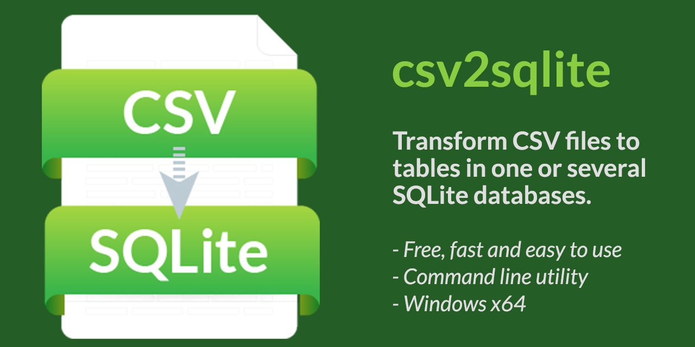

csv2sqlite
===================
csv2sqlite is a fast and simple to use conversion tool that converts the content of a CSV file into a table in a SQLite database file.

* Comma character has to be used between columns.
* Double quote characters (") can be used to mark the start and end of a column.
* The number of columns is automatically found.
* The tool will assume that the first row is a header row including the column names.

The tool can also be used to import the content of many CSV files into the same SQLite database file.

Developed using C++.

Usage
===================
```
usage: csv2sqlite.exe -o <db file> -f <csv file> [-t <name>] [-h]

   -o <db file>      SQLite file (REQUIRED)
   -f <csv file>     CSV file    (REQUIRED)
   -t <name>         Use this table name (OPTIONAL)
   -h                Help
```

Examples
===================
`csv2log.exe -o test.db -f statistics.csv`<br>
The data will be inserted into a table name named as the filename of the csv file. In this case to "statistics".

`csv2log.exe -o test.db -f statistics.csv -t numbers`<br>
The data will be inserted into a table name called "numbers".

<i><ins>Please notice:</ins> If the table name already exists in the SQLite database and the number of columns matches, the content of the CSV file will be added to the table like an INSERT.</i>

Execution time
===================
Below, a CSV file with a file size of 61 570 904 bytes (~61.6 MB) was used.<br>
Execution time was 297 ms on an i7-10510U running MS Windows 10 Pro (19045).

```
*** csv2sqlite ver. 1.0 (c) 2023, swepeba ***
MIT License - https://github.com/swepeba/csv2sqlite

INFORMATION
---> A new database file will be created
---> CSV file: test.csv
------> Rows in CSV file: 36420
------> Cols in CSV file: 26

SUMMARY
---> Rows converted: 36420 (297 ms)
---> SUCCESS, all rows converted
```

Download
===================
A pre-built and signed [binary (.exe)](https://github.com/swepeba/csv2sqlite/releases/latest) is found in the latest release.

Future releases
===================
* Support for bulk conversion of all CSV files in a folder. In version 1.0 the tool has to be executed for each CSV file.

Release notes
===================
ver. 1.0 (2023-05-16)
* First release.

License
===================
Copyright (c) swepeba.
Licensed under the [MIT License](LICENSE).
